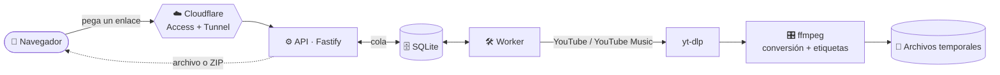

<div align="center">


<br>

**Descarga canciones y playlists de YouTube y YouTube Music como audio MP3 o M4A, directo desde el navegador.**

<br>

[](https://nodejs.org)
[](https://www.typescriptlang.org)
[](https://react.dev)
[](https://tailwindcss.com)
[](https://fastify.dev)
[](docs/deployment-cloudflare.md)

[](https://github.com/wilrd14/Music_Downloader/actions/workflows/ci.yml)
[](#-pruebas)
[](docs/phases.md)
[](LICENSE)

[Características](#-características) ·
[Cómo funciona](#-cómo-funciona) ·
[Inicio rápido](#-inicio-rápido) ·
[Seguridad](#-seguridad) ·
[Roadmap](#-roadmap) ·
[Changelog](CHANGELOG.md)

</div>

---

## ✨ Características

|   |   |
|---|---|
| 🔗 **Un enlace, un clic** | Pegas el link, ves una vista previa con portada y pistas, y descargas. Sin cuentas ni registro. |
| 🎵 **Canciones y playlists** | Una canción llega como archivo suelto; una playlist, como un **ZIP** con las pistas numeradas. |
| ☑️ **Tú eliges** | Marca solo las canciones que quieras de una playlist (hasta 100 por descarga). |
| 🎚️ **MP3 o M4A** | MP3 a 320 kbps o M4A, con **título, artista y portada** incrustados. |
| 📡 **Progreso en vivo** | Barra por canción y total, actualizada en tiempo real (SSE), y puedes cerrar la pestaña y volver. |
| 🌗 **Interfaz moderna** | Tema claro y oscuro, responsive hasta 375 px, accesible y en español. |
| 🧹 **Nada se queda guardado** | Los archivos se borran solos a los 30 minutos. |
| 🔁 **Resistente** | Cada pista que falla se reintenta una vez, y los errores se explican con un mensaje claro. |

### Fuentes soportadas

| Fuente | Canción | Playlist |
|---|:---:|:---:|
| **YouTube** | ✅ | ✅ |
| **YouTube Music** | ✅ | ✅ |

---

## 🧭 Cómo funciona



1. La **API** valida el enlace, lo resuelve y crea un trabajo en la cola.
2. El **worker** descarga cada pista, la convierte con ffmpeg y la etiqueta.
3. El navegador sigue el progreso por **SSE** y, al terminar, recibe el archivo o el ZIP.
4. Pasados 30 minutos, el worker **borra** todo.

El diseño interno y la referencia de la API están en [`docs/architecture.md`](docs/architecture.md).

---

## 🚀 Inicio rápido

### Requisitos

- **Node.js ≥ 22.13** (el backend usa `node:sqlite`; se desarrolla con Node 24)
- **yt-dlp** y **ffmpeg**

```powershell
winget install yt-dlp.yt-dlp
winget install Gyan.FFmpeg
```

> Cierra y vuelve a abrir la terminal para que el PATH se actualice. Comprueba todo con `.\scripts\check-tools.ps1`.

### Instalar y ejecutar

```powershell
# 1) Backend: API en 127.0.0.1:8787 + worker
cd backend
copy .env.example .env
npm install
npm run dev
```

```powershell
# 2) Frontend, en otra terminal
cd frontend
npm install
npm run dev
```

Abre **<http://localhost:5173>** y pega un enlace. 🎉

### Una sola URL (modo producción)

El backend también puede servir la interfaz compilada, en el mismo origen que la API:

```powershell
cd frontend; npm run build        # genera frontend\dist
cd ..\backend; npm run start:api  # y, en otra terminal, npm run start:worker
```

### Que arranque solo (Windows)

```powershell
.\scripts\install-autostart.ps1 -StartNow      # backend: tarea programada con supervisor que lo reinicia si se cae
.\scripts\install-tunnel-service.ps1           # túnel de Cloudflare como servicio (PowerShell como administrador)
.\scripts\status.ps1                           # ver de un vistazo si todo está funcionando
```

Más detalle (y cómo detenerlo) en [`docs/deployment-cloudflare.md`](docs/deployment-cloudflare.md).

<details>
<summary><b>⚙️ Variables de entorno (<code>backend/.env</code>)</b></summary>

<br>

| Variable | Por defecto | Descripción |
|---|---|---|
| `API_PORT` | `8787` | Puerto de la API. Siempre escucha en `127.0.0.1`. |
| `STATIC_DIR` | `../frontend/dist` | Carpeta de la interfaz compilada que sirve el backend. |
| `MAX_TRACKS_PER_JOB` | `100` | Máximo de canciones por descarga. |
| `JOB_TTL_MINUTES` | `30` | Minutos que se conserva un trabajo terminado antes de borrar sus archivos. |
| `TRACK_TIMEOUT_MINUTES` | `10` | Tiempo máximo por pista (descarga + conversión). |
| `WORKER_CONCURRENCY` | `2` | Trabajos que el worker procesa en paralelo. |
| `TRACK_CONCURRENCY` | `3` | Canciones de un mismo trabajo que se descargan a la vez (`1` = en serie). |
| `MAX_PARALLEL_DOWNLOADS` | `4` | Tope global de descargas (yt-dlp + ffmpeg) simultáneas sumando todos los trabajos. Protege la CPU y evita que YouTube limite las peticiones. |
| `CORS_ORIGIN` | — | Origen permitido por CORS; solo si el frontend vive en otro dominio. |
| `TUNEDROP_MODE` | `local` | `local`: cada persona lo ejecuta en su PC y guarda en su carpeta de música (sin límites por IP ni Turnstile). `server`: servicio público con límites, Turnstile y ZIP. |
| `DOWNLOAD_DIR` | `<home>/Music/tunedrop` | Modo local: carpeta de música si no hay una elegida en la interfaz (el ajuste guardado manda). |
| `TUNEDROP_BIN_DIR` | `<app>/bin` | Carpeta donde se busca primero `yt-dlp` y `ffmpeg` empaquetados. |
| `YT_DLP_AUTO_UPDATE` | `1` en local | Actualiza `yt-dlp` al arrancar (máx. cada 24 h) solo si es el de `bin/`. `0` lo desactiva. |
| `TUNEDROP_NO_BROWSER` | — | `1` evita abrir el navegador al arrancar el modo local. |
| `DATA_DIR` | `backend/data` (servidor) · carpeta de aplicación del SO (local) | Base SQLite (`tunedrop.db`), `settings.json` y archivos temporales (`jobs/`, solo servidor). |
| `YT_DLP_PATH` | `yt-dlp` | Ruta a yt-dlp si no está en el PATH (`.exe`, no `.cmd`). |
| `FFMPEG_PATH` | — | Ruta a `ffmpeg.exe` o a la carpeta que lo contiene. |
| `RATE_LIMIT_GENERAL_PER_MIN` | `120` | Peticiones por minuto y por IP a `/api/*`. |
| `RATE_LIMIT_RESOLVE_PER_MIN` | `20` | Peticiones por minuto y por IP a `POST /api/resolve`. |
| `RATE_LIMIT_JOBS_PER_MIN` | `6` | Peticiones por minuto y por IP a `POST /api/jobs`. |
| `RATE_LIMIT_DOWNLOAD_PER_MIN` | `30` | Peticiones por minuto y por IP a `/api/jobs/:id/download`. |
| `MAX_QUEUED_JOBS` | `30` | Máximo de trabajos en cola (global); al llenarse se responde 429. |
| `MAX_ACTIVE_JOBS_PER_IP` | `2` | Máximo de trabajos en cola o en curso por IP; si se supera, 429. |
| `MAX_DISK_MB` | `4096` | Tamaño máximo de `data/jobs`; al alcanzarlo no se aceptan trabajos nuevos (503). |
| `TURNSTILE_SITE_KEY` / `TURNSTILE_SECRET_KEY` | — | Cloudflare Turnstile (anti-bots). Con la clave secreta, `POST /api/jobs` exige el token; sin ella no se verifica (solo desarrollo). |

</details>

---

## 🗂️ Estructura

No es un monorepo: son dos proyectos independientes, cada uno con su propio `package.json`.

```text
Music_Downloader/
├── backend/                 Node + TypeScript + Fastify
│   └── src/
│       ├── api/             Servidor HTTP (/api/*) y entrega de la interfaz
│       ├── worker/          Procesa la cola y limpia archivos expirados
│       ├── core/            Configuración, cola SQLite, tipos, utilidades
│       └── resolvers/       youtube (yt-dlp) y utilidades de procesos
├── frontend/                React + Vite + Tailwind
├── docs/                    Arquitectura, despliegue, seguridad y fases
└── scripts/                 PowerShell: arranque, supervisor, estado, instalación de servicios
```

---

## 🧪 Pruebas

```powershell
cd backend
npm test            # 85 pruebas (node:test)
npm run typecheck

cd ..\frontend
npm run typecheck
npm run build
```

Las pruebas no necesitan red ni los binarios de descarga.

---

## 🔒 Seguridad

Diseñado siguiendo las [recomendaciones de MDN sobre seguridad web](https://developer.mozilla.org/es/docs/Learn_web_development/Extensions/Server-side/First_steps/Website_security):

- 🛡️ Cabeceras de seguridad y **CSP** estricta (sin scripts en línea).
- 🔑 Los `POST` solo se aceptan como JSON, y los identificadores de descarga son **UUID**.
- 📂 Solo se sirven archivos dentro de la carpeta de trabajos; los nombres se sanean.
- ⌨️ `yt-dlp` y `ffmpeg` se ejecutan **sin shell** y con las URLs detrás de `--`.
- ⏱️ Límites de cuerpo, de tiempo por pista y de canciones por descarga.
- 🚦 **Límites por IP** (se usa `CF-Connecting-IP` del túnel), topes de cola, de descargas simultáneas por IP y de disco.
- 🤖 **Cloudflare Turnstile** en la creación de descargas; las IPs no se guardan (solo una huella con clave secreta) y las filas de trabajos antiguos se borran a las 24 h.
- 🔐 En las pruebas privadas, **Cloudflare Access** deja entrar solo a correos autorizados.

Estado y checklist previa al lanzamiento público: [`docs/security.md`](docs/security.md).

---

## 🗺️ Roadmap

| Fase | Contenido | Estado |
|---|---|:---:|
| **1** | YouTube: canción y playlist → archivo o ZIP, interfaz web | ✅ |
| **2** | Etiquetas y portada incrustadas, seguridad base | ✅ |
| **3** | Despliegue privado: Cloudflare Tunnel + Access en `tunedrop.wilrd14.dev` | ✅ |
| **4** | Arranque automático ✅ · límites por IP · Turnstile 🚧 | 🚧 |
| **5** | Apertura pública: decisión legal, host siempre encendido, monitoreo | ⏳ |

Detalle en [`docs/phases.md`](docs/phases.md) · Historial en [`CHANGELOG.md`](CHANGELOG.md).

---

## 📚 Documentación

| Documento | Contenido |
|---|---|
| [`docs/architecture.md`](docs/architecture.md) | Componentes, flujo, estados de un trabajo, API y cómo añadir una fuente nueva |
| [`docs/deployment-cloudflare.md`](docs/deployment-cloudflare.md) | Túnel, DNS y Access paso a paso, y cómo apagarlo o borrarlo |
| [`docs/security.md`](docs/security.md) | Amenazas, estado de cada una y checklist de lanzamiento |
| [`docs/phases.md`](docs/phases.md) | Fases del proyecto |

---

## ⚖️ Aviso legal

tunedrop es una herramienta para **uso personal** y para contenido que tienes derecho a descargar: tus propias obras, contenido con licencia libre o dominio público, o con permiso del titular. Descargar material protegido por derechos de autor sin autorización puede infringir la ley y los términos de servicio de YouTube y otras plataformas.

**La responsabilidad del uso y de la operación de cualquier instancia desplegada recae en quien la opera y en quien la utiliza.** Los autores no se hacen responsables del uso indebido. Este proyecto no está afiliado a YouTube ni a Google.

## 📄 Licencia

Distribuido bajo la licencia **GNU GPL v3.0**. Consulta [`LICENSE`](LICENSE).

<div align="center">

<sub>Hecho con 💜 por <a href="https://github.com/wilrd14">@wilrd14</a></sub>

</div>
